# Game Recommender System

This project has been created to demonstrate the use and applications of game recommender systems, and the algorithms that go into creating them.

## System Overview

### System Architecture Overview

The following diagram illustrates how the various components of the system are interlinked:

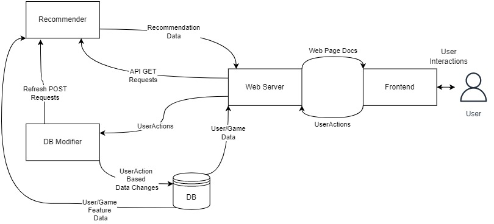

The Web Server serves the web pages to the user's computer. These pages are rendered using ejs in the backend, as explained later. The data for this task comes from the recommender API server, and from the database.

The user interacts with the frontend, where a JS script monitors user activity. This script creates objects, which are called **UserActions**. These are sent to the web server, which sends them to the DB Modifier server. More on this is covered later.

The DB Modifier is responsible for 2 tasks:

1. Resolving UserActions to reflect changes in the database.
2. Causing the recommender to be updated to reflect the latest state of the DB, from time to time. 

The Recommender server is the server that analyses the behaviour of users, and based on the user profile, game profiles, and user - game interactions, provides recommendations. It provides an API based interface for this. The interface, and the internal workings of the recommender are described later.

### Database Overview

The database cluster consists of **2 NoSQL Databases**:

1. recommenderDb: It contains the data primarily used by the recommender. It has the following 4 collections:

    1. allGameData: Info about games.
    2. allUserData: Info about users.
    3. gameFeatures: Game Profiles.
    4. userGameInteractions: Info about interaction between users and games, with an implicit rating per interaction.
2. sysDB: It contains the data required for the system to work, but not used for recommender predictions. Its collections are:

    1. featuredGames: The ids of 4 games chosen manually to be 'Editor's Choice' games.
    2. genres: The list of genres in the system, along with their ids.
    3. mergeByAndCodes: The numbers that denote a genre search merger by AND (see the section on Genre Based Search below).
    4. modelRefreshPasswords: The valid passwords that can be used to cause the recommendet to be refreshed.
    5. userGameBehaviour: The information that is received by monitoring how users interact with games.
    6. userGenreBehaviour: The information that is received by monitoring how users interact with genres.

### Frontend Overview

The frontend, i.e., the website serves as a way to display information about games, and also as a method to monitor how the user interacts with games and genres, to fine tune the recommendations.

## Demo Specific Featues

To allow ease of demonstration of the recommender engine, the following things have been incorporated:

1. The website has a sign in option, that allows any user to signin. This signin only requires a specification of the user id. NO PASSWORD IS NEEDED. This allows easy signins, to see the recommender response from the perspective of different users.
2. The website, apart from implementing password less signins, also has the feature to demonstrate how the recommender will function in case a new user signs up. In the sign in box, there is an option to **enter new user demo mode**. Pressing it causes the website to reload, with the **New User** signed in. Also, an alert is shown that informs about the details of this new user. These are the details that any new user is expected to provide upon signup. Also, an option to reset the new user data is available. This option resets the new user data, thus 'refreshing' the new user. Such functionality has been added to demonstrate how the system responds to new users, as far as recommendations are concerned, and to what extent **Cold Start Problem** is resolved.
3. There is a third option, to logout, in the signin panel. This causes the recommendations to be non - personalized. Also, **no user monitoring is done if the user is logged out**.

> As it stands, there are 50 + 2 users in the database, along with 28256 games. For the users, there are users with ids 0 through 49. These are the actual users. The user id -2 represents the **new user** described in point 2 above. A user id of -1 represents the logged out state, i.e., the **null user**. Monitoring is paused if the user id is -1 (that is, if the user is logged out).

## Website Navigation

### Quick Start

When the website is opened for the first time, you will be logged out. You may choose to browse the website like this, or, you may login as a user. For now, let's login as the *New User*:

1. Press the login button to open the login modal.
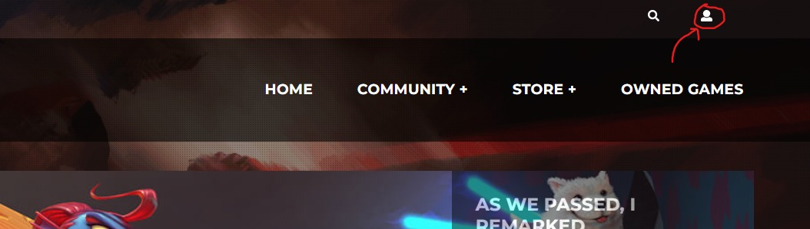
2. Press the option that says 'Enter new user demo mode'.
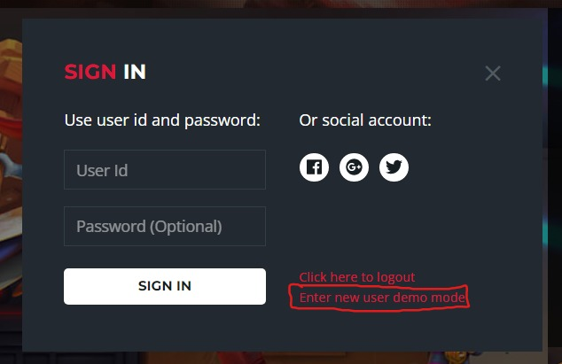
3. The following alert will appear. It details the information that the new user was asked to submit while signing up.
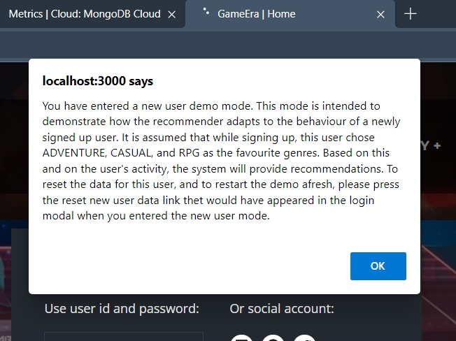
4. To clear any residual data from any previous demonstration of the new user, open the login modal as before (point 1), and press the 'Reset new user data' option that would have appeared. This will reload the website. In the background, the new user data in the database and the recommender will be refreshed.
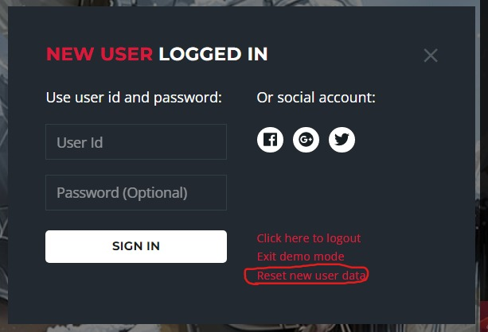

> Congratulations! You are now logged in as a new user.

> To login as any other user, in the login modal, enter the user id of that user. Currently, the user ids go from 0 through 49.

To navigate between pages, the links on the navbar can be used.

The navbar has the following structure:
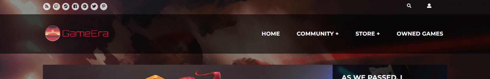

On hovering over any of the tabs that have the '+' sign next to them, a menu opens that leads to more pages:
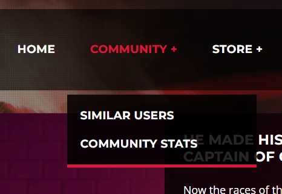

The following sections detail the features of the individual pages. Note that wherever multiple games are recommended, the **most relevant game is displayed first, or displayed in an emplasized section**.

### Home Page

The home page has the following functional components:
1. **Favourite Genres**: 3 genres displayed at the top, which are the top 3 genres the user likes.
2. **Your Recommendations**: The games that are most suited to the user's profile (i.e., the user's genre preferences).
3. **Editor's Choices**: 4 games hand picked by the editors, common to all users.
4. **Other Users Also Liked**: These are the games that users similar to the current user liked.

### Community Stats Page

This page gives the number of games and the number of users in the database. The number of users includes the *null user* (user id = -1) and the *new user* (user id = -2).

### Similar User Page

This page gives the id's of the users who are similar to the current user. This is done for all users, including the case when the user is signed out. This is because the user id of a signed out user is -1, and corresponding to the profile of user id -1, recommendations can still be found. This page is mainly intended as a page to suggest friends to the user for jointly playing the games, or, to interact.

Note that clicking the user ids of the suggested users has no effect. The user ids are recommended based on the current user's profile.

### Store Page

This page has the following functional components:
1. **Favourite Genres**: 3 genres displayed at the top, which are the top 3 genres the user likes.
2. **6 Games at the top**: These are the top 6 games that the user would like.
3. **Top 10 Recommendations**: These are 10 recommended games the user would like, based on her profile.
4. **Featured Games**: Just like the home screen, these 4 games are the 4 hand picked games, chosen by the editors. They are common to all the users.
5. **Most Popular**: These are the games that are recommended to the user, based on the preferences of the users similar to the current user.

### Catalog Page

This page has the following functional components:
1. **Favourite Genres**: 3 genres displayed at the top, which are the top 3 genres the user likes.
2. **Recommendations**: These are the games that are recommended to the current user, based on the user's profile.
3. **Category Menu**: This menu lists some genres. The user can search for relevant games having any of these genres. More on this is covered in the section 'Genre Based Search'.
4. **Other Users Also Liked**: These are the games that users similar to the current user liked.

### Owned Games Page

This page displays the games owned by a user. Games are added to this page when a user presses the 'Buy' button. As it may take some time for the corresponding UserAction to be processed, the 'Update List' button is provided to reload the page. Buying an owned game doesn't affect anything.

### Game Page

On pressing the title or image of any game, the corresponding page for that game opens. This page has the following functional components:
1. **Game Description**: The description of the game for which the page was opened.
2. **Reviews Tab**: In this tab, the users can give their review ratings. These ratings are internally used to learn user preferences, as detailed later.
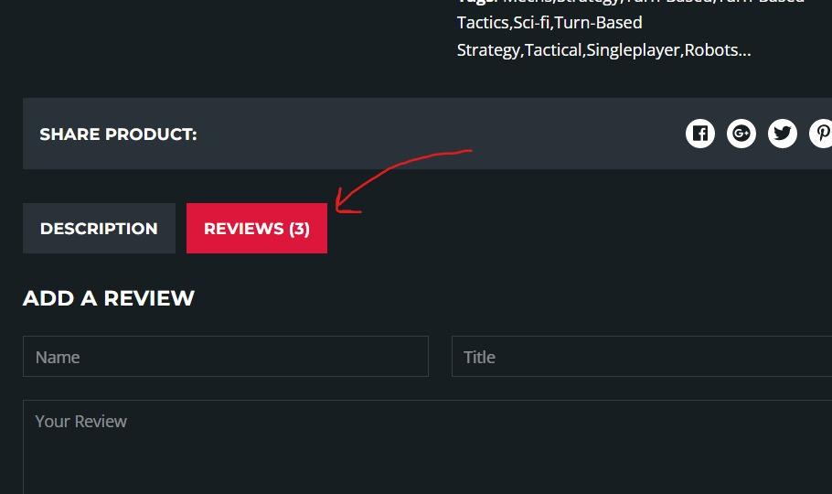

3. **Category Menu**: This menu lists some genres. The user can search for relevant games having any of these genres. More on this is covered in the section 'Genre Based Search'.
4. **Other Users Also Liked**: These are the games that users similar to the current user liked.
5. **Related Products**: The games similar to the currently viewed game.

### Signins

As described in the Quickstart, the signin button on the top right of the page opens the login modal. From here, we can login/logout, enter the new user demo mode, and reset the new user's data.

Signin Button:
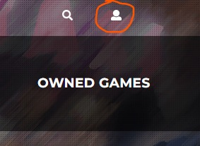

Signin Modal:
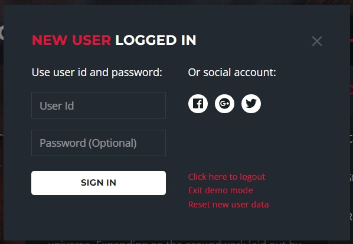

### Genre Based Search

There are 2 ways to perform a search based on genre:

1. Choosing a ganre from the Category Menus
2. Choosing 1 or more genres from the search modal.

Use the following button to open the search modal:

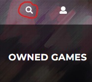

The search modal looks like this:

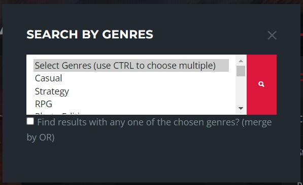

In the search modal, from the list, multiple genres can be selected using the `CTRL` key. The check box, if checked, causes the selected genres to be merged by OR, i.e., those games will be found that have at least one of the selected genres. In case it is unchecked, the genres will be merged by AND, i.e., those games that have all of the selected genres will be found. This type of merger may occasionally lead to no game being found, if no game satisfies the condition.

Once the search for a genre is done, either by the search modal, or by the Category Menu, the search results appear on a page similar to the catalog page, with one difference, that the recommendations are only of the games that satisfy the search criteria.

## Recommender API Server Documentation

### Server Specific Documentation

### Recommender Module

## DBModify Server Documetation

### New User Refresh

### User Monitoring and UserActions

## Web Server Documentation

### Database Related Functions

### Recommender Related Functions

### Server Routes

### Caching

#### Recommender Cache

#### Database Caches