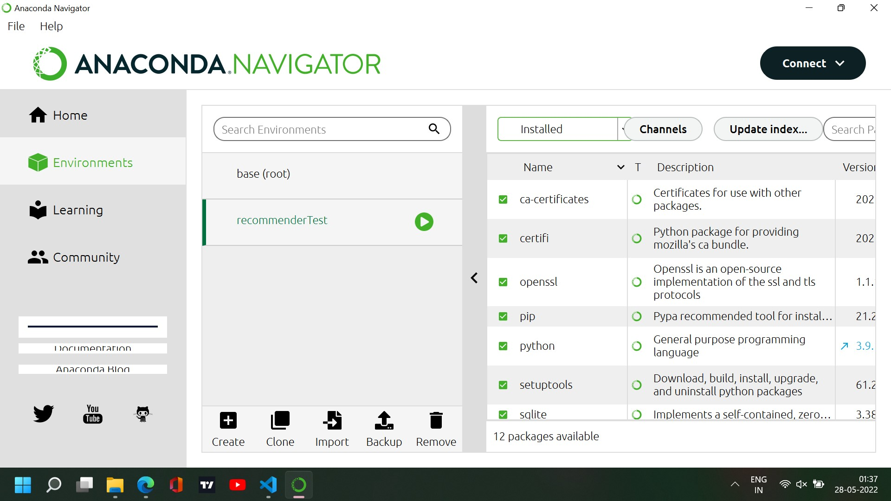
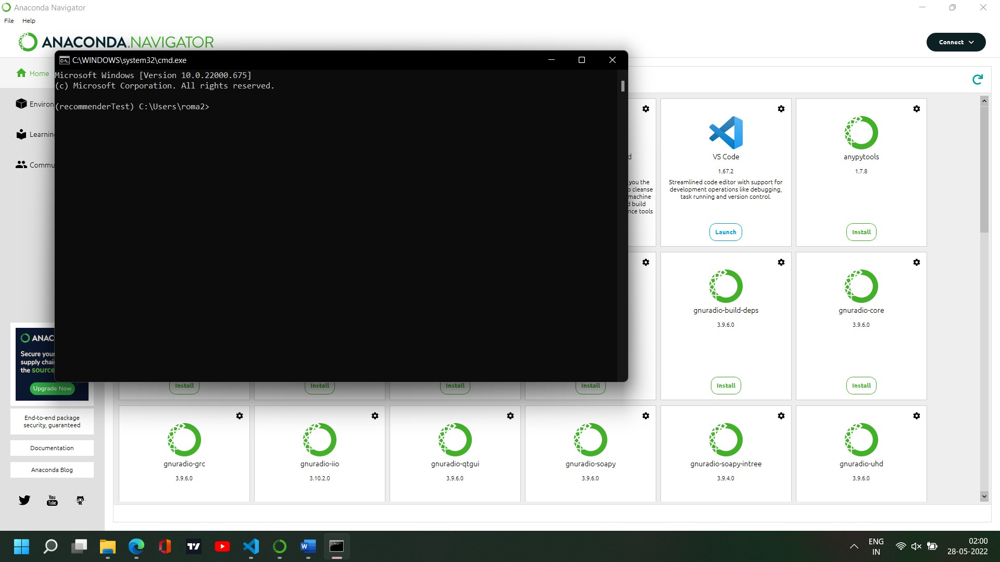

# Game Recommender System

This project has been created as a part of the Microsoft Engage submission to demonstrate the use and applications of game recommender systems, and the algorithms that go into creating them.

## Steps To Run Locally


Please follow these steps to run the 3 servers (architecture described below) locally. For this, python 3.9.12 was used. The OS used was Windows 11, but it should work on Windows 10 as well. 

> If ports `3000`, `4000`, and `5000` are free on `localhost (127.0.0.1)`, the following steps can be followed, but, if they aren't free, please first read the steps below, along with the [.env And Config Modifications](#env-and-config-modifications) section.

The steps are:

> Note: Edge was used for testing and developing the frontend scripts. The code also works in Chrome, but may lead to issues in firefox.

1. Install git.
2. Clone the github repo in any folder of your chioce.
3. Install anaconda (here, version 2.2.0 was used).
4. Install node.
5. Install nodemon via npm (`npm install -g nodemon`).
6. Install python **3.9**.12 from its [official website](https://www.python.org/downloads/release/python-3912/).
7. Open anaconda navigator.
8. Click the *environments tab*.
9. Click the *create* button to create a new conda environment, called `recommenderTest` for now. **Ensure `python 3.9` is being used in the environment.**



10. Once created, press the *channels* button.
11. Press the *add* button, to add the `conda-forge` channel.


12. Press the *update channels* button.
13. Now, from anaconda navigator, install the following packages: `pandas`, `scipy`, `numpy`, `flask`, `pymongo`, `lightfm`, `scikit-learn`.
14. Now, go back to the home tab, keeping the environment `recommenderTest` throughout. Locate the card that states `CMD.exe Prompt`. Install and launch it, to get a terminal with the `recommenderTest` conda environment activated.



15. Once the terminal opens, go to the folder of the repo cloned in step (2). The folder will contain a folder called `RecommenderAPI Server`. Navigate to this folder fron the terminal.
16. In the terminal, just to ensure that the pip being used is the correct one, run the command `pip -V`. If the output is like below, and the pip installed in the `recommenderTest` environment is being used, you're good to go!


> Incase this doesn't show up, manually locate the pip installation present in the `recommenderTest` environment. It will be present in a path similar to the one shown in the picture.

17. Run `pip install readerwriterlock`
18. Run `pip install "pymongo[srv]"`
19. Now, ensure you are in the `RecommenderAPI Server` as in point (15), via the terminal that has the `recommenderTest` environment activated, as in point (14). Now, run `python main.py`. The recommender API server should begin now. It will initialize its various components. This may take some time. Please ensure this task is fully completed before proceeding.

> By default, the recommender API server will start on `http://127.0.0.1:5000/`. This was the localhost port 5000 in case of my laptop. The API server can also be accessed via `http://localhost:5000/`. To prevent any issues, please ensure port 5000 is free. If any problem does arise, refer to the sub section on [.env And Config Modifications](#env-and-config-modifications) to run on a different port.

20. Now that the recommender server is running, we can go to the `Web Server`. From any other terminal, from the repo folder, go to the sub folder named `Web Server`. Here, run the following commands:

```bash
npm i
npm i cookie-parser axios node-cache

nodemon app.js
```

> Running the command `nodemon app.js` will start the Web Server. It will run at `http://localhost:3000/`. The port used here is port 3000. To change this port, refer to the sub section on [.env And Config Modifications](#env-and-config-modifications).

21. Now, the web server is up and running, only the DBModify Server is left to be run. Open another terminal, and navigate to the repo's root folder. From here, cd into the `DBModify Server` folder.

22. Run the following commands to get the requisite modules:

```bash
npm i
npm i async-mutex

nodemon app.js
```

> Running the command `nodemon app.js` will start the DB Modify Server. It will run at `http://localhost:4000/`. The port used here is port 4000. To change this port, refer to the sub section on [.env And Config Modifications](#env-and-config-modifications).

### .env And Config Modifications

There are 3 config files, as follows:

1. [.env file for the Web Server](/Web%20Server/.env)
2. [.env file for the DBModify Server](/DBModify%20Server/.env)
3. [constants.py file for the RecommenderAPI Server](/RecommenderAPI%20Server/constants.py)

These files have the following environment variables declared. Here, they are described, along with the guidelines to change them as per needs:

1. \[Mongo + SRV URL\] `DB_CLUSTER_URL`: This is the URL to the MongoDB Atlas cluster, that contains the data. Most probably, it will not have to be modified.
2. \[Non-Negative Integer\] `PORT`: This variable is present in the .env files for the Web Server, and for the DBModify Server. For each of those servers individually, this value provides the port where the servers must run. It is different for both servers, with the default values being `3000 for Web Server` and `4000 for DBModify Server`. If any of these ports are busy, change the corresponding port number to a free port. Please note that the 2 PORT variables, in either of the config files are for 2 different servers, and must themselves have 2 different values. (The specified port must also be free for both.)
3. \[Non-Negative Integer\] `FLASK_PORT`: Like the `PORT` environment variable, this provides the port where the RecommenderAPI Server must run. By default, this port is `port 5000`. As the `constants.py` file is a python file, please be sure to enter a new port value, if needed, as an integer number (no 'singe quotes' or "double quotes").
4. \[HTTP URL\] `REC_URL`: This is the URL of the RecommenderAPI Server. This environment variable is present both in Web Server's and DBModify Server's .env files. The default value is `"http://127.0.0.1:5000"`. This tells the servers that the recommender API server is running on port 5000, with the `127.0.0.1` being the `localhost` address. This exact value (the full URL with port) is received when running the Flask server as in point (19) above, in the terminal window, and can be matched and verified from there.
5. \[HTTP URL\] `DB_MODIFIER_URL`: This is the URL of the DBModify Server. This environment variable is present in the .env file of the Web Server. By default, it is `"http://localhost:4000"`. In case the DBModify Server is not running on port 4000, but on some other port, please modify the port in the URL to be the port where the DBModify Server is running.
6. \[Positive Integer (>=1)\] `MAX_UA_COUNT`: This is a value specific to the .env file of DBModify Server. It defines the maximum number of UserActions allowed to occur, before the recommender is refreshed with updated data from the database (more on this is covered in the sections below). If this value is low, user actions will be completely reflected in the recommendations promptly, but it may have some performance impact on the RecommenderAPI Server. If kept high, UserActions will be reflected in the recommendations partially when they occur, and some type of recommendations might not fully reflect the user actions quickly (as the recommender will be refreshed less frequently), but the performance impact which occured before will be very lessened here. Currently its value is `20` for demonstrability. **However, if lot's of people will be using the website simultaneously, it is recommended to increase its value to around 200, or more, depending upon the number of users. (More users => higher value)**

> It is important to use the environment variables carefully. They must have valid data, or, the system might crash, or misbehave. HTTP URLs must be valid, and NOT end with a '/'. 
>```
>http://localhost:4000/ -> INVALID
>http://localhost:4000 -> VALID
>```
> Also, the port numbers are non - negative values. They can vary from 0 through 65535. Please ensure that for `PORT` and `FLASK_PORT`, correct values are used. The `MAX_UA_COUNT` needs to be an integer equal to or greater than 1. As it is used within the code, wrong values/datatypes will lead to errors. Although the MongoDB address need not be changed, if it does need to be changed, please ensure it is correctly replaced. Wherever any discrepancy may occur, the format in which the current environment variables are specified is the format to follow.


## System Overview

### System Architecture Overview

The following diagram illustrates how the various components of the system are interlinked:


The Web Server serves the web pages to the user's computer. These pages are rendered using ejs in the backend, as explained later. The data for this task comes from the recommender API server, and from the database.

The user interacts with the frontend, where a JS script monitors user activity. This script creates objects, which are called **UserActions**. These are sent to the web server, which sends them to the DB Modifier server. More on this is covered later.

The DB Modifier is responsible for 2 tasks:

1. Resolving UserActions to reflect changes in the database.
2. Causing the recommender to be updated to reflect the latest state of the DB, from time to time. 

The Recommender server is the server that analyses the behaviour of users, and based on the user profile, game profiles, and user - game interactions, provides recommendations. It provides an API based interface for this. The interface, and the internal workings of the recommender are described later.

### Database Overview

The database cluster consists of **2 NoSQL Databases**:

1. recommenderDB: It contains the data primarily used by the recommender. It has the following 4 collections:

    1. allGameData: Info about games.
    2. allUserData: Info about users.
    3. gameFeatures: Game Profiles.
    4. userGameInteractions: Info about interaction between users and games, with an implicit rating per interaction.
2. sysDB: It contains the data required for the system to work, but not used for recommender predictions. Its collections are:

    1. featuredGames: The ids of 4 games chosen manually to be 'Editor's Choice' games.
    2. genres: The list of genres in the system, along with their ids.
    3. mergeByAndCodes: The numbers that denote a genre search merger by AND (see the section on Genre Based Search below).
    4. modelRefreshPasswords: The valid passwords that can be used to cause the recommendet to be refreshed.
    5. userGameBehaviour: The information that is received by monitoring how users interact with games.
    6. userGenreBehaviour: The information that is received by monitoring how users interact with genres.

### Frontend Overview

The frontend, i.e., the website serves as a way to display information about games, and also as a method to monitor how the user interacts with games and genres, to fine tune the recommendations.

## Demo Specific Featues

To allow ease of demonstration of the recommender engine, the following things have been incorporated:

1. The website has a sign in option, that allows any user to signin. This signin only requires a specification of the user id. NO PASSWORD IS NEEDED. This allows easy signins, to see the recommender response from the perspective of different users.
2. The website, apart from implementing password less signins, also has the feature to demonstrate how the recommender will function in case a new user signs up. In the sign in box, there is an option to **enter new user demo mode**. Pressing it causes the website to reload, with the **New User** signed in. Also, an alert is shown that informs about the details of this new user. These are the details that any new user is expected to provide upon signup. Also, an option to reset the new user data is available. This option resets the new user data, thus 'refreshing' the new user. Such functionality has been added to demonstrate how the system responds to new users, as far as recommendations are concerned, and to what extent **Cold Start Problem** is resolved.
3. There is a third option, to logout, in the signin panel. This causes the recommendations to be non - personalized. Also, **no user monitoring is done if the user is logged out**.

> As it stands, there are 50 + 2 users in the database, along with 28256 games. For the users, there are users with ids 0 through 49. These are the actual users. The user id -2 represents the **new user** described in point 2 above. A user id of -1 represents the logged out state, i.e., the **null user**. Monitoring is paused if the user id is -1 (that is, if the user is logged out).

## Website Navigation

### Quick Start

When the website is opened for the first time, you will be logged out. You may choose to browse the website like this, or, you may login as a user. For now, let's login as the *New User*:

1. Press the login button to open the login modal.

2. Press the option that says 'Enter new user demo mode'.

3. The following alert will appear. It details the information that the new user was asked to submit while signing up.

4. To clear any residual data from any previous demonstration of the new user, open the login modal as before (point 1), and press the 'Reset new user data' option that would have appeared. This will reload the website. In the background, the new user data in the database and the recommender will be refreshed.


> Congratulations! You are now logged in as a new user.

> To login as any other user, in the login modal, enter the user id of that user. Currently, the user ids go from 0 through 49.

To navigate between pages, the links on the navbar can be used.

The navbar has the following structure:


On hovering over any of the tabs that have the '+' sign next to them, a menu opens that leads to more pages:


The following sections detail the features of the individual pages. Note that wherever multiple games are recommended, the **most relevant game is displayed first, or displayed in an emplasized section**.

### Home Page

The home page has the following functional components:
1. **Favourite Genres**: 3 genres displayed at the top, which are the top 3 genres the user likes.
2. **Your Recommendations**: The games that are most suited to the user's profile (i.e., the user's genre preferences).
3. **Editor's Choices**: 4 games hand picked by the editors, common to all users.
4. **Other Users Also Liked**: These are the games that users similar to the current user liked.

### Community Stats Page

This page gives the number of games and the number of users in the database. The number of users includes the *null user* (user id = -1) and the *new user* (user id = -2).

### Similar User Page

This page gives the id's of the users who are similar to the current user. This is done for all users, including the case when the user is signed out. This is because the user id of a signed out user is -1, and corresponding to the profile of user id -1, recommendations can still be found. This page is mainly intended as a page to suggest friends to the user for jointly playing the games, or, to interact.

Note that clicking the user ids of the suggested users has no effect. The user ids are recommended based on the current user's profile.

### Store Page

This page has the following functional components:
1. **Favourite Genres**: 3 genres displayed at the top, which are the top 3 genres the user likes.
2. **6 Games at the top**: These are the top 6 games that the user would like.
3. **Top 10 Recommendations**: These are 10 recommended games the user would like, based on her profile.
4. **Featured Games**: Just like the home screen, these 4 games are the 4 hand picked games, chosen by the editors. They are common to all the users.
5. **Most Popular**: These are the games that are recommended to the user, based on the preferences of the users similar to the current user.

### Catalog Page

This page has the following functional components:
1. **Favourite Genres**: 3 genres displayed at the top, which are the top 3 genres the user likes.
2. **Recommendations**: These are the games that are recommended to the current user, based on the user's profile.
3. **Category Menu**: This menu lists some genres. The user can search for relevant games having any of these genres. More on this is covered in the section 'Genre Based Search'.
4. **Other Users Also Liked**: These are the games that users similar to the current user liked.

### Owned Games Page

This page displays the games owned by a user. Games are added to this page when a user presses the 'Buy' button. As it may take some time for the corresponding UserAction to be processed, the 'Update List' button is provided to reload the page. Buying an owned game doesn't affect anything.

### Game Page

On pressing the title or image of any game, the corresponding page for that game opens. This page has the following functional components:
1. **Game Description**: The description of the game for which the page was opened.
2. **Reviews Tab**: In this tab, the users can give their review ratings. These ratings are internally used to learn user preferences, as detailed later.


3. **Category Menu**: This menu lists some genres. The user can search for relevant games having any of these genres. More on this is covered in the section 'Genre Based Search'.
4. **Other Users Also Liked**: These are the games that users similar to the current user liked.
5. **Related Products**: The games similar to the currently viewed game.

### Signins

As described in the Quickstart, the signin button on the top right of the page opens the login modal. From here, we can login/logout, enter the new user demo mode, and reset the new user's data.

Signin Button:


Signin Modal:


### Genre Based Search

There are 2 ways to perform a search based on genre:

1. Choosing a ganre from the Category Menus
2. Choosing 1 or more genres from the search modal.

Use the following button to open the search modal:


The search modal looks like this:


In the search modal, from the list, multiple genres can be selected using the `CTRL` key. The check box, if checked, causes the selected genres to be merged by OR, i.e., those games will be found that have at least one of the selected genres. In case it is unchecked, the genres will be merged by AND, i.e., those games that have all of the selected genres will be found. This type of merger may occasionally lead to no game being found, if no game satisfies the condition.

Once the search for a genre is done, either by the search modal, or by the Category Menu, the search results appear on a page similar to the catalog page, with one difference, that the recommendations are only of the games that satisfy the search criteria.

## Recommender API Server Documentation

### Server Specific Documentation

The recommender API is implemented as a server. It is a microservice, that provides recommendations for different types of queries. It provides 4 GET endpoints and 1 POST endpoint, as detailed below:

1. GET **/user_game_rec**: It provides game recommendations for a user. It needs 2 URL parameters:
    1. `uid`: \[REQUIRED\] The id of the user for whom the recommendations are needed.
    2. `k`: \[OPTIONAL\] The maximum number of recommendations to provide.

The returned value is a JSON string, with the following format:

```json
{    
    "message": "The message in the response.",
    "recommendations": {
        "profile_based": "list of game recommendations for the user on the basis of user profile (content - based recommendations). Most relevant games come first.",
        "similar_user_based": "list of game recommendations for the user on the basis of choices of similar users (collaborative filtering based recommendations). Most relevant games come first.",
        "owned": "list of games that the user owns."
    }
}
```

2. GET **/user_user_rec**: Get users similar to a given user. The URL parameters are:
    1. `uid`: \[REQUIRED\] The id of the user for whom the recommendations are needed.
    2. `k`: \[OPTIONAL\] The maximum number of recommendations to provide.

The returned value is a JSON string, with the following format:

```json
{
    "message": "The message in the response.",
    "recommendations": "A list of recommendations. The id of the most recommended user/item comes first."
}
```

3. GET **/game_game_rec**: Get games similar to a given game. The URL parameters are:
    1. `game_id`: \[REQUIRED\] The id of the game for which the recommendations are needed.
    2. `k`: \[OPTIONAL\] The maximum number of recommendations to provide.

The returned value is a JSON string, with the following format:

```json
{
    "message": "The message in the response.",
    "recommendations": "A list of recommendations. The id of the most recommended user/item comes first."
}
```

4. GET **/genre_game_rec**: Get game recommendations for a user, with games of the specified genres. The URL parameters are:
    1. `uid`: \[REQUIRED\] The id of the user for whom the recommendations are needed.
    2. `k`: \[OPTIONAL\] The maximum number of recommendations to provide.
    3. `genres`: \[REQUIRED\] The comma - separated, list of genre ids for which the games are to be found.
    4. `merge_by_and`: \[REQUIRED\] If True, the games having all the specified genres are chosen. Else, games having at least one genre are chosen.

The returned value is a JSON string, with the following format:

```json
{
    "message": "The message in the response.",
    "recommendations": "A list of recommendations. The id of the most recommended user/item comes first."
}
```

5. POST **/refresh_model_data**: A POST request to this endpoint causes the recommender model data to be refreshed, i.e., reloaded from the database. The request must contain a password in its header. If the password matches the one in the record (in database), only then model data is refreshed. The header must include:
    1. `pw`: \[REQUIRED\] A valid password to authorize the refreshing of model.

The returned value is a JSON string, with the following format:

```json
{
    "message": "The message in the response.",
}
```

### Recommender Module

The recommender module is an object. It provides various public methods, corresponding to each of the API requests outlined above. It uses 2 types of algorithms to provide recommendations:

1. **Collaborative Filtering**: This algorithm is implemented using a matrix factorization based ML model, provided by the lightFM library. It is used to provide game recommendations for a user. The recommendations it provides allow for diversity in the recommendations. It uses implicit rating assigned to a game by a user. The way this rating is calculated is described later.

2. **Content Based Filtering**: This algorithm is implemented by the `NearestNeighbors` estimator provided by the scikit-learn library. It allows for user profiles and game profiles to be used, to find the most relevant users/games. The distance metric used for finding the nearest neighbors is the **cosine distance** metric.

## DBModify Server Documetation

This server performs the following 2 tasks. They are focussed around updation of the DB, and recommender refreshing.

### New User Refresh

Whenever the 'Reset new user data' option is clicked, the data for the new user, i.e., the user with the user id -2 is reset to its original state. Also, a refresh request id made to the recommender to cause the refreshing of its information, to reflect the latest database state. With each new user reset, the recommender is refreshed (as it is assumed that immediate rollback to the initial state is required). This is a demo based operation, and should not be done multiple times, as it will lead to multiple recommender refreshes, with some refreshes being redundant.

### User Monitoring and UserActions

User monitoring is implemented in 2 parts:

1. On the frontend, a script monitors 4 types of user interactions: visiting the search page of some genres, visiting the information page of a game, rating a game, and buying a game. For each of these interactions, a corresponding UserAction object is created. This object contains the necessary information to identify its type, and to allow the changes to be reflected in the database. Multiple UserAction objects are placed in an array on the frontend. When the `visibilitychange` event is triggered, this array is sent in a POST request to the Web Server. The Web Server validates the format of the received data (it must be valid JSON), and passes it on in a post request to the DBModify server.
2. The DBModify server receives the user actions, and, according to the type of the user action, processes the UserAction object in the corresponding manner. In this process, it updates the database also. When the number of received UserActions exceeds a predefined amount, a refresh request is made to the recommender, and it is refreshed.

Based on user actions, the values for the genre preferences are calculated as:

```
Preference for genre g = (no. of visits to a search page with g in search query) / (total visits to search page for any genre(s))

I.e., what ratio of genre based searches done by the user included genre g.
```

Based on user actions, the values for the game preferences are calculated as:

```
Preference for game g = (number of visits to g's game page + 3 * (ownership status of g (1 if owned, else 0)) + 2 * (rating given to g)) / 6
```


## Web Server Documentation

The Web Server is the main server that loads the web pages. GET requests to the web server cause different pages to load. Its functionalities are described below.

### Database Related Work

Multiple functions exist that allow for obtaining different types of data from the database. These data include game details, user details, and database metrics (i.e., number of games and number of users). These functions also include caching of data. This mechanism is described later.

### Recommender Related Work

4 functions each corresponding to one of the recommender API server's GET endpoints are present. These functions allow for obtaining recommendations, and provide an easy to use interface to interact with the recommender API server. These functions also include caching of data. This mechanism is described later.

### Server Routes

Multiple GET routes exist on the server, each corresponding to one of the many web pages of the website.

One POST route also exists. This is the endpoint to which the script monitoring the user actions on the frontend sends the UserAction objects (they are forwarded to the DBModify server, as described previously).

### Caching

Caching is implemented on the Web Server. There are 3 caches, 2 for DB related caching, and 1 for caching recommender API results.

#### Recommender Cache

It is a cache that stores the recommendation results that are received from the recommender server. The results are stored for a fixed amount of time, and then are discarded.

This cache is used in the 4 recommender related functions. When a cache hit corresponding to the current data requirement occurs, the data from the cache is used. On a cache miss, data is fetched from the recommender.

#### Database Caches

There are 2 database caches. One cache is for game details, and the other is for game feature details (i.e., numeric data associated with any game, and its game profile).

These caches are used in the corresponding database quering functions. On a cache hit, data from cache is used, else, data is fetched from server.
